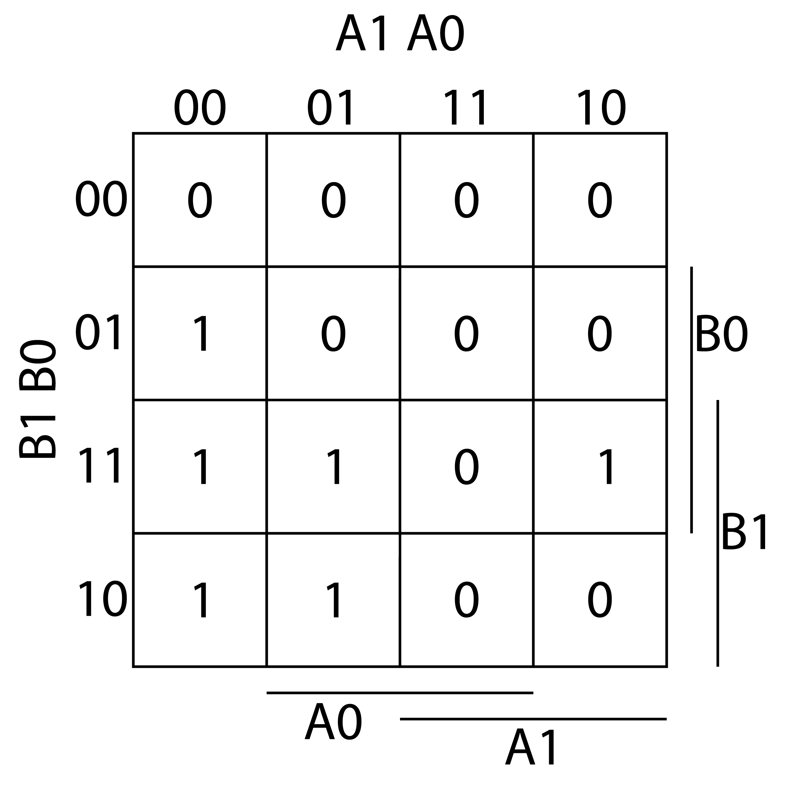
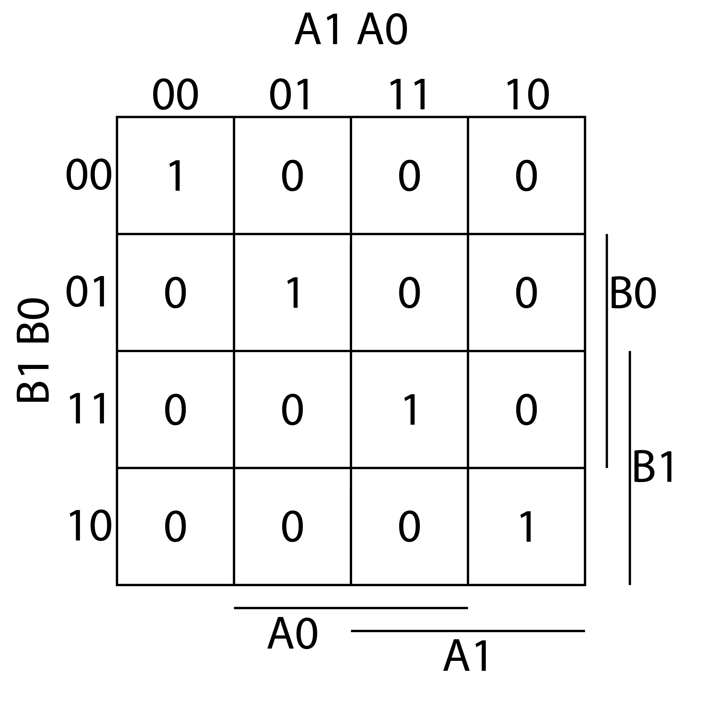
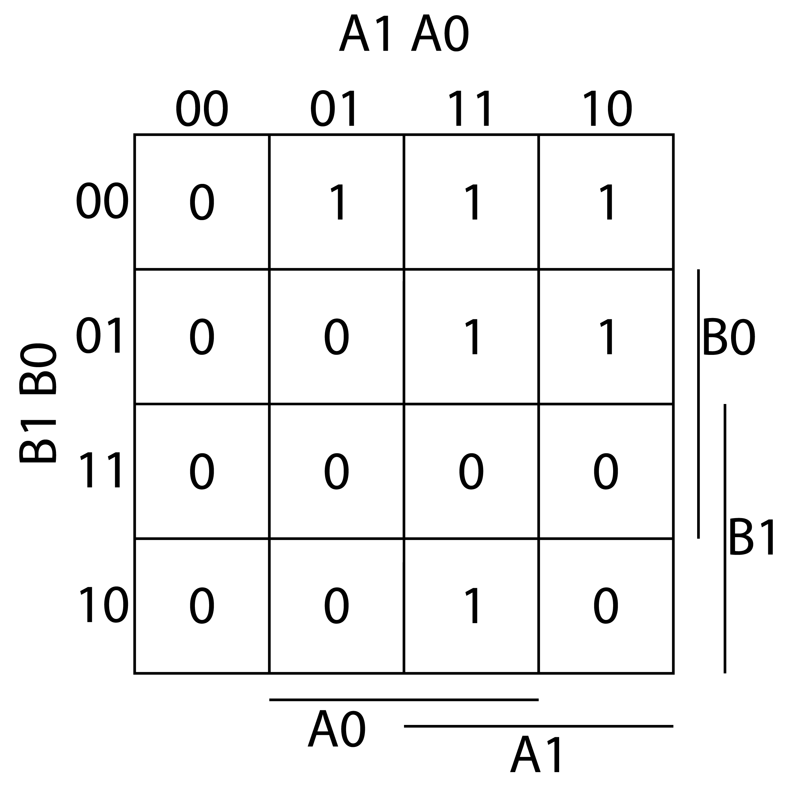
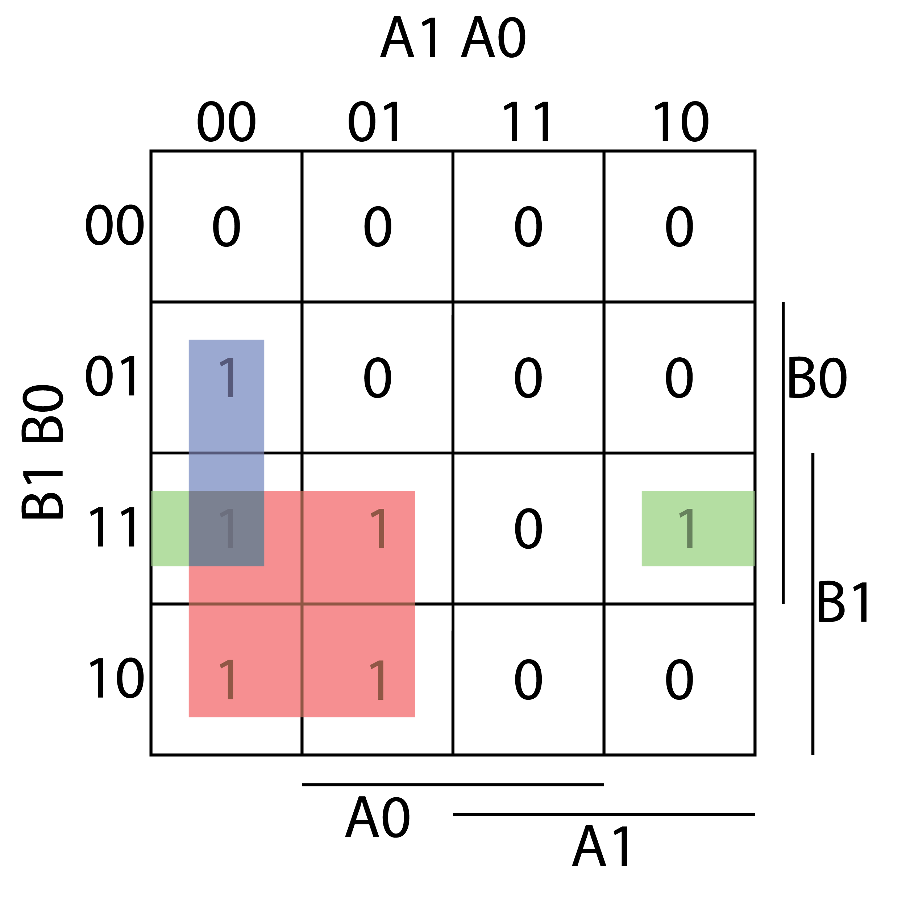
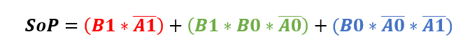
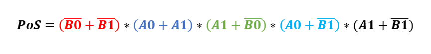
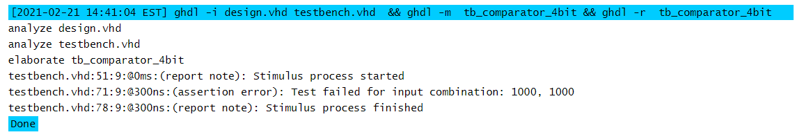

# Labs - 02 - logic

## Lab assignment

1. Preparation tasks (done before the lab at home). Submit:
   * Completed 2-bit comparator truth table.

2. A 2-bit comparator. Submit:
   * Karnaugh maps for all three functions.
   * Equations of simplified SoP form of the "greater than" function and simplified PoS form of the "less than" function.
   * Link to your public EDA Playground example in the form `https://www.edaplayground.com/...`

3. A 4-bit binary comparator. Submit:
    * Listing of VHDL architecture from design file (`design.vhd`) with syntax highlighting,
    * Listing of VHDL stimulus process from testbench file (`testbench.vhd`) with syntax highlighting,
    * Listing of simulator console output, i.e. with one reported error,
    * Link to your public EDA Playground example in the form `https://www.edaplayground.com/...`


## 1. Preparation tasks (done before the lab at home).

*Digital* or *Binary comparator* compares the digital signals A, B presented at input terminal and produce outputs depending upon the condition of those inputs. Complete the truth table for 2-bit *Identity comparator* (B equals A), and two *Magnitude comparators* (B is greater than A, B is less than A). Note that, such a digital device has four inputs and three outputs/functions.

| **Dec. equivalent** | **B[1:0]** | **A[1:0]** | **B is greater than A** | **B equals A** | **B is less than A** |
| :-: | :-: | :-: | :-: | :-: | :-: |
| 0 | 0 0 | 0 0 | 0 | 1 | 0 |
| 1 | 0 0 | 0 1 | 0 | 0 | 1 |
| 2 | 0 0 | 1 0 | 0 | 0 | 1 |
| 3 | 0 0 | 1 1 | 0 | 0 | 1 |
| 4 | 0 1 | 0 0 | 1 | 0 | 0 |
| 5 | 0 1 | 0 1 | 0 | 1 | 0 |
| 6 | 0 1 | 1 0 | 0 | 0 | 1 |
| 7 | 0 1 | 1 1 | 0 | 0 | 1 |
| 8 | 1 0 | 0 0 | 1 | 0 | 0 |
| 9 | 1 0 | 0 1 | 1 | 0 | 0 |
| 10 | 1 0 | 1 0 | 0 | 1 | 0 |
| 11 | 1 0 | 1 1 | 0 | 0 | 1 |
| 12 | 1 1 | 0 0 | 1 | 0 | 0 |
| 13 | 1 1 | 0 1 | 1 | 0 | 0 |
| 14 | 1 1 | 1 0 | 1 | 0 | 0 |
| 15 | 1 1 | 1 1 | 0 | 1 | 0 |

## 2. A 2-bit comparator.

### 2.1. Karnaugh maps for all three functions

### Karnaugh map - B is greater than A



### Karnaugh map - B equals A



### Karnaugh map - B is less than A



### 2.2. Equations of simplified SoP form of the "greater than" function and simplified PoS form of the "less than" function.

#### Sum of Product of the "greater than" function





#### Product of Sum of the "greater than" function




### 2.3. Link to my public EDA Playground 

EDA Playground code ([LINK](https://www.edaplayground.com/x/kAMu))

## 3. A 4-bit binary comparator.

### 3.1. Listing of VHDL architecture from design file (`design.vhd`) with syntax highlighting

> Excerpt from `design.vhd`:
```vhdl
architecture Behavioral of comparator_4bit is
begin
	
    B_less_A_o   <= '1' when (b_i < a_i) else '0';
    
    B_greater_A_o   <= '1' when (b_i > a_i) else '0';
    
    B_equals_A_o   <= '1' when (b_i = a_i) else '0';
    
end architecture Behavioral;
```

### 3.2. Listing of VHDL stimulus process from testbench file (`testbench.vhd`) with syntax highlighting,

> Excerpt from `design.vhd`:
```vhdl
    p_stimulus : process
    begin
        -- Report a note at the begining of stimulus process
        report "Stimulus process started" severity note;

        -- First test values
        s_b <= "0000"; s_a <= "0000"; wait for 100 ns;
        -- Expected output
        assert ((s_B_greater_A = '0') and (s_B_equals_A = '1') and (s_B_less_A = '0'))
        -- If false, then report an error
        report "Test failed for input combination: 0000, 0000" severity error;
        
        -- Second test values
        s_b <= "1000"; s_a <= "0100"; wait for 100 ns;
        assert ((s_B_greater_A = '1') and (s_B_equals_A = '0') and (s_B_less_A = '0'))
        report "Test failed for input combination: 1000, 0100" severity error;
        
        -- Third test values (Mistake)
        s_b <= "1000"; s_a <= "1000"; wait for 100 ns;
        assert ((s_B_greater_A = '0') and (s_B_equals_A = '0') and (s_B_less_A = '1'))
        report "Test failed for input combination: 1000, 1000" severity error;
        
        -- Report a note at the end of stimulus process
        report "Stimulus process finished" severity note;
        wait;
    end process p_stimulus;
```

### 3.3. Listing of simulator console output, i.e. with one reported error



### 3.4. Link to my public EDA Playground 

EDA Playground code ([LINK](https://www.edaplayground.com/x/wfKF))

