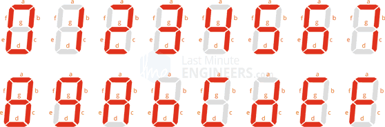

# Labs - 04 - Segment

## Lab assignment

1. Preparation tasks (done before the lab at home). Submit:
    * Figure or table with connection of 7-segment displays on Nexys A7 board,
    * Decoder truth table for common anode 7-segment display.

2. Seven-segment display decoder. Submit:
    * Listing of VHDL architecture from source file `hex_7seg.vhd` with syntax highlighting,
    * Listing of VHDL stimulus process from testbench file `tb_hex_7seg.vhd` with syntax highlighting and asserts,
    * Screenshot with simulated time waveforms; always display all inputs and outputs,
    * Listing of VHDL code from source file `top.vhd` with 7-segment module instantiation.

3. LED(7:4) indicators. Submit:
    * Truth table and listing of VHDL code for LEDs(7:4) with syntax highlighting,
    * Screenshot with simulated time waveforms; always display all inputs and outputs.
    
## 1. Preparation tasks (done before the lab at home).

### 1.1. Figure or table with connection of 7-segment displays on Nexys A7 board


### 1.2. Decoder truth table for common anode 7-segment display

| **Hex** | **Input** | **A** | **B** | **C** | **D** | **E** | **F** | **G** |
| :-: | :-: | :-: | :-: | :-: | :-: | :-: | :-: | :-: |
| 0 | 0000 | 0 | 0 | 0 | 0 | 0 | 0 | 1 |
| 1 | 0001 | 1 | 0 | 0 | 1 | 1 | 1 | 1 |
| 2 | 0010 | 0 | 0 | 1 | 0 | 0 | 1 | 0 |
| 3 | 0011 | 0 | 0 | 0 | 0 | 1 | 1 | 0 |
| 4 | 0100 | 1 | 0 | 0 | 1 | 1 | 0 | 0 |
| 5 | 0101 | 0 | 1 | 0 | 0 | 1 | 0 | 0 |
| 6 | 0110 | 0 | 1 | 0 | 0 | 0 | 0 | 0 |
| 7 | 0111 | 0 | 0 | 0 | 1 | 1 | 1 | 1 |
| 8 | 1000 | 0 | 0 | 0 | 0 | 0 | 0 | 0 |
| 9 | 1001 | 0 | 0 | 0 | 0 | 1 | 0 | 0 |
| A | 1010 | 0 | 0 | 0 | 1 | 0 | 0 | 0 |
| b | 1011 | 1 | 1 | 0 | 0 | 0 | 0 | 0 |
| C | 1100 | 0 | 1 | 1 | 0 | 0 | 0 | 1 |
| d | 1101 | 1 | 0 | 0 | 0 | 0 | 1 | 0 |
| E | 1110 | 0 | 1 | 1 | 0 | 0 | 0 | 0 |
| F | 1111 | 0 | 1 | 1 | 1 | 0 | 0 | 0 |

7 Segment formulation numbers and letters



## 2. Seven-segment display decoder.

### 2.1. Listing of VHDL architecture from source file `hex_7seg.vhd` with syntax highlighting

```vhdl
architecture behavioral of hex_7seg is
begin
 p_7seg_decoder : process(hex_i)
    begin
        case hex_i is
            when "0000" =>
                seg_o <= "0000001";     -- 0
            when "0001" =>
                seg_o <= "1001111";     -- 1   
            when "0010" =>
                seg_o <= "0010010";     -- 2
            when "0011" =>
                seg_o <= "0000110";     -- 3
            when "0100" =>
                seg_o <= "1001100";     -- 4
            when "0101" =>
                seg_o <= "0100100";     -- 5
            when "0110" =>
                seg_o <= "0100000";     -- 6
            when "0111" =>
                seg_o <= "0001111";     -- 7
           when "1000" =>
                seg_o <= "0000000";     -- 8
            when "1001" =>
                seg_o <= "0000100";     -- 9
            when "1010" =>
                seg_o <= "0001000";     -- A
            when "1011" =>
                seg_o <= "1100000";     -- B
            when "1100" =>
                seg_o <= "0110001";     -- C
            when "1101" =>
                seg_o <= "1000010";     -- D
            when "1110" =>
                seg_o <= "0110000";     -- E
            when others =>
                seg_o <= "0111000";     -- F
        end case;
    end process p_7seg_decoder;

end architecture behavioral;
```

### 2.2. Listing of VHDL stimulus process from testbench file `tb_hex_7seg.vhd` with syntax highlighting and asserts

### 2.3. Screenshot with simulated time waveforms; always display all inputs and outputs

### 2.4. Listing of VHDL code from source file `top.vhd` with 7-segment module instantiation


## 3. LED(7:4) indicators.
