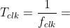

# Labs - 05 - Counter

## Experiments on your own

1. Add a second instantiation (copy) of the counter (`bin_cnt1`) and clock enable (`clk_en1`) entities and make a 16-bit counter with a different time base. Display its value on LED(15:0).

## Lab assignment

1. Preparation tasks (done before the lab at home). Submit:
    * Figure or table with connection of push buttons on Nexys A7 board,
    * Table with calculated values.

2. Bidirectional counter. Submit:
    * Listing of VHDL code of the process `p_cnt_up_down` with syntax highlighting.
    * Listing of VHDL reset and stimulus processes from testbench file `tb_cnt_up_down.vhd` with syntax highlighting and asserts,
    * Screenshot with simulated time waveforms; always display all inputs and outputs,

3. Top level. Submit:
    * Listing of VHDL code from source file `top.vhd` with all instantiations for the 4-bit bidirectional counter.
    * (Hand-drawn) sketch of the top layer including both counters, ie a 4-bit bidirectional counter from Part 4 and a 16-bit counter with a different time base from Part Experiments on your own.

## 1. Preparation tasks (done before the lab at home)

### 1.1. Figure or table with connection of push buttons on Nexys A7 board
### 1.2. Table with calculated values

The Nexys A7 board provides five push buttons for user applications. See schematic or reference manual of the Nexys A7 board and find out the connection of these push buttons, ie to which FPGA pins are connected and how (schema). What logic/voltage value do the buttons generate when not pressed and what value when the buttons are pressed?

&nbsp;

&nbsp;

&nbsp;

&nbsp;

&nbsp;

&nbsp;

Calculate how many periods of clock signal with frequency of 100&nbsp;MHz contain time intervals 2&nbsp;ms, 4&nbsp;ms, 10&nbsp;ms, 250&nbsp;ms, 500&nbsp;ms, and 1&nbsp;s. Write values in decimal, binary, and hexadecimal forms.

   &nbsp; 
   
   &nbsp;

   | **Time interval** | **Number of clk periods** | **Number of clk periods in hex** | **Number of clk periods in binary** |
   | :-: | :-: | :-: | :-: |
   | 2&nbsp;ms | 200 000 | `x"3_0d40"` | `b"0011_0000_1101_0100_0000"` |
   | 4&nbsp;ms | 400 000 |
   | 10&nbsp;ms | 1 000 000 |
   | 250&nbsp;ms | 25 000 000 |
   | 500&nbsp;ms | 50 000 000 |
   | 1&nbsp;sec | 100 000 000 | `x"5F5_E100"` | `b"0101_1111_0101_1110_0001_0000_0000"` |
