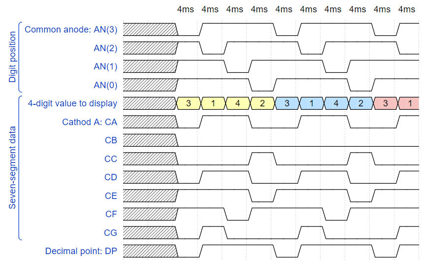

# Labs - 06 - Display_driver


## Experiments on your own

1. On your smartphone, set slow motion video recording and observe the seven-segment display behavior:)
2. Extend the duration of one symbol on the 7-segment display ie. generic `g_MAX` in `driver_7seg_4digit.vhd` file and experimentally determine the maximum value at which switching by the human eye is not yet observable.
3. Design the structure of `driver_7seg_8digits` module, which controls all eight 7-segment displays.


## Lab assignment

1. Preparation tasks (done before the lab at home). Submit:
    * Timing diagram figure for displaying value `3.142`.

2. Display driver. Submit:
    * Listing of VHDL code of the process `p_mux` with syntax highlighting.
    * Listing of VHDL testbench file `tb_driver_7seg_4digits` with syntax highlighting and asserts,
    * Screenshot with simulated time waveforms; always display all inputs and outputs,
    * Listing of VHDL architecture of the top layer.

3. Eight-digit driver. Submit:
    * Image of the driver schematic. The image can be drawn on a computer or by hand.

## 1. Preparation tasks

### 1.1. Timing diagram figure for displaying value `3.142`



```javascript
{
  signal:
  [
    ['Digit position',
      {name: 'Common anode: AN(3)', wave: 'xx01..01..01'},
      {name: 'AN(2)', wave: 'xx1'},
      {name: 'AN(1)', wave: 'xx1'},
      {name: 'AN(0)', wave: 'xx1'},
    ],
    ['Seven-segment data',
      {name: '4-digit value to display', wave: 'xx3333555599', data: ['3','1','4','2','3','1','4','2','3','1']},
      {name: 'Cathod A: CA', wave: 'xx01.0.1.0.1'},
      {name: 'CB', wave: 'xx0'},
      {name: 'CC', wave: 'xx0'},
      {name: 'CD', wave: 'xx0'},
      {name: 'CE', wave: 'xx1'},
      {name: 'CF', wave: 'xx1'},
      {name: 'CG', wave: 'xx0'},
    ],
    {name: 'Decimal point: DP', wave: 'xx01..01..01'},
  ],
  head:
  {
    text: '                    4ms   4ms   4ms   4ms   4ms   4ms   4ms   4ms   4ms   4ms',
  },
}
```

## 2. Display driver

## 3.
