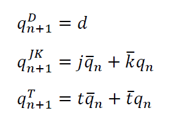
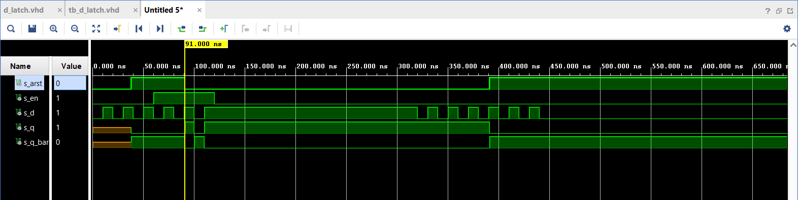

# Labs - 07 - Latches and Flip-flops

## Lab assignment

1. Preparation tasks (done before the lab at home). Submit:
    * Characteristic equations and completed tables for D, JK, T flip-flops.

2. D latch. Submit:
    * VHDL code listing of the process `p_d_latch` with syntax highlighting,
    * Listing of VHDL reset and stimulus processes from the testbench `tb_d_latch.vhd` file with syntax highlighting and asserts,
    * Screenshot with simulated time waveforms; always display all inputs and outputs. The full functionality of the entity must be verified.

3. Flip-flops. Submit:
    * VHDL code listing of the processes `p_d_ff_arst`, `p_d_ff_rst`, `p_jk_ff_rst`, `p_t_ff_rst` with syntax highlighting,
    * Listing of VHDL clock, reset and stimulus processes from the testbench files with syntax highlighting and asserts,
    * Screenshot with simulated time waveforms; always display all inputs and outputs. The full functionality of the entities must be verified.

4. Shift register. Submit:
    * Image of the shift register schematic. The image can be drawn on a computer or by hand. Name all inputs, outputs, components and internal signals.

## 1. Preparation tasks

### 1.1. Characteristic equations and completed tables for D, JK, T flip-flops



   | **clk** | **d** | **q(n)** | **q(n+1)** | **Comments** |
   | :-: | :-: | :-: | :-: | :-- |
   |  | 0 | 0 | 0 | No change |
   |  | 0 | 1 | 0 | Change |
   |  | 1 | 1 | 1 | No change |
   |  | 1 | 0 | 1 | Change |

   | **clk** | **j** | **k** | **q(n)** | **q(n+1)** | **Comments** |
   | :-: | :-: | :-: | :-: | :-: | :-- |
   |  | 0 | 0 | 0 | 0 | No change |
   |  | 0 | 0 | 1 | 1 | No change |
   |  | 0 | 1 | 0 | 0 | Reset |
   |  | 0 | 1 | 1 | 0 | Reset |
   |  | 1 | 0 | 0 | 1 | Set |
   |  | 1 | 0 | 1 | 1 | Set |
   |  | 1 | 1 | 0 | 1 | Toggle |
   |  | 1 | 1 | 1 | 0 | Toggle |

   | **clk** | **t** | **q(n)** | **q(n+1)** | **Comments** |
   | :-: | :-: | :-: | :-: | :-- |
   |  | 0 | 0 | 0 | No change |
   |  | 0 | 1 | 1 | No change |
   |  | 1 | 0 | 1 | Invert |
   |  | 1 | 1 | 0 | Invert |
   
## 2. D latch

### 2.1. VHDL code listing of the process `p_d_latch` with syntax highlighting

```vhdl
    p_d_latch : process (d, arst, en)                                                        
    begin                                                                                    
        if (arst = '1') then                                                                 
            q     <= '0';                                                                    
            q_bar <= '1';
                                                                                
        elsif (en = '1') then                                                               
            q     <= d;                                                                          
            q_bar <= not d;                                                                          
        end if;                                                                              
    end process p_d_latch;
```

### 2.2. Listing of VHDL reset and stimulus processes from the testbench `tb_d_latch.vhd` file with syntax highlighting and asserts

```vhdl
    p_stimulus  : process
    begin
    report "Stimulus process started" severity note;
    s_d  <= '0';
    s_en <= '0';
    
    assert(s_q = '0')
    report "Error" severity error;
    
    --d sekv
    wait for 10 ns;
    s_d  <= '1';
    wait for 10 ns;
    s_d  <= '0';
    wait for 10 ns;
    s_d  <= '1';
    wait for 10 ns;
    s_d  <= '0';
    wait for 10 ns;
    s_d  <= '1';
    wait for 10 ns;
    s_d  <= '0';
    --/d sekv
    
    assert(s_q = '0' and s_q_bar = '1')
    report "Error" severity error;
    
    s_en <= '1';
    
    --d sekv
    wait for 10 ns;
    s_d  <= '1';
    wait for 10 ns;
    s_d  <= '0';
    wait for 10 ns;
    s_d  <= '1';
    wait for 10 ns;
    s_d  <= '0';
    wait for 10 ns;
    s_d  <= '1';
    wait for 10 ns;
    s_en  <= '0';  -- en to 0
    wait for 200 ns;
    s_d  <= '0';    
    --/d sekv
    
    --d sekv
    wait for 10 ns;
    s_d  <= '1';
    wait for 10 ns;
    s_d  <= '0';
    wait for 10 ns;
    s_d  <= '1';
    wait for 10 ns;
    s_d  <= '0';
    wait for 10 ns;
    s_d  <= '1';
    wait for 10 ns;
    s_d  <= '0';
    --/d sekv
    
    --d sekv
    wait for 10 ns;
    s_d  <= '1';
    wait for 10 ns;
    s_d  <= '0';
    wait for 10 ns;
    s_d  <= '1';
    wait for 10 ns;
    s_d  <= '0';
    wait for 10 ns;
    s_d  <= '1';
    wait for 10 ns;
    s_d  <= '0';
    --/d sekv
    
    report "Stimulus process finished" severity note;
    wait;
    end process p_stimulus;
```    

### 2.3. Screenshot with simulated time waveforms; always display all inputs and outputs. The full functionality of the entity must be verified



## 3. Flip-flops

### 3.1. VHDL code listing of the processes `p_d_ff_arst`, `p_d_ff_rst`, `p_jk_ff_rst`, `p_t_ff_rst` with syntax highlighting

Process `p_d_ff_arst`

```vhdl
    p_d_ff_arst : process (clk, arst)             
    begin                                         
        if (arst = '1') then                      
            q     <= '0';                         
            q_bar <= '1';
                                    
        elsif  rising_edge(clk) then                    
            q     <= d;                               
            q_bar <= not d;                       
        end if;                                   
    end process p_d_ff_arst;
```

Process `p_d_ff_rst`

Process `p_jk_ff_rst`

```vhdl
    p_jk_ff_rst : process (clk)             
    begin                                         
      if rising_edge(clk) then 
          if (rst = '1') then
              s_q <= '0';
          else
              if    (j = '0' and k = '0') then
                  s_q <= s_q;
                  
              elsif (j = '0' and k = '1') then
                  s_q <= '0';
                  
              elsif (j = '1' and k = '0') then
                  s_q <= '1';
                  
              elsif (j = '1' and k = '1') then                   
                  s_q <= not s_q; 
                   
              end if; 
            end if;                   
        end if;                                   
    end process p_jk_ff_rst;       

  q     <= s_q;
  q_bar <= not s_q;
```

Process `p_t_ff_rst`

### 3.2. Listing of VHDL clock, reset and stimulus processes from the testbench files with syntax highlighting and asserts

Stimulus process from the testbench `tb_d_ff_arst`

```vhdl
    p_stimulus : process
    begin
        report "Stimulus process started" severity note;
        s_d <= '0';
        
        --d sekv
        wait for 14 ns;
        s_d  <= '1';
        wait for 10 ns;
        s_d  <= '0';
        
        wait for 6 ns;
--        assert()
--        report "";
        
        wait for 4 ns;
        s_d  <= '1';
        wait for 10 ns;
        s_d  <= '0';
        wait for 10 ns;
        s_d  <= '1';
        wait for 10 ns;
        s_d  <= '0';   
        --/d sekv
        
        --d sekv
        wait for 10 ns;
        s_d  <= '1';
        wait for 10 ns;
        s_d  <= '0';
        wait for 10 ns;
        s_d  <= '1';
        wait for 10 ns;
        s_d  <= '0';
        wait for 10 ns;
        s_d  <= '1';
        wait for 10 ns;
        s_d  <= '0';   
        --/d sekv
        
    report "Stimulus process finished" severity note;
    wait;
    end process p_stimulus;
```

### 3.3. Screenshot with simulated time waveforms; always display all inputs and outputs. The full functionality of the entities must be verified
